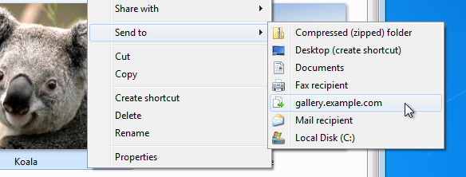

# Uploader

A Windows tool for quick and easy FTP uploads.



Be advised, Uploader is work in progress and it's not yet released. Additionally, this document may cover features or configuration options that are not implemented yet. Use at own risk.

## Uploader

### Introduction

Uploader is a tool for rapid and comfortable FTP uploads.

I created Uploader because unlike Linux, where command-line and shell scripts are way to go, Windows has no easy way to handle FTP uploads.

Uploader works well with *Send To* functionality. After a successful upload it automatically copies web URLs to clipboard to share with others.

### Usage

```
Uploader [/profile your_profile] file(s)
```

Uploader uploads file(s) to remote FTP server based on provided configuration file.

FTP configuration is stored in .ini files in ```profiles``` subdirectory. 

To send a file based on default profile (it's same as the executable filename ```Uploader.exe```, in this case, it's ```profiles/Uploader.ini```):

```
Uploader file.txt
```

To send multiple files based on other profile, such as Monty (```profiles/Monty.ini```):

```
Uploader /profile Monty john.txt eric.txt
```

Please keep in mind that if Uploader fails to find its configuration or its default profile, they will be created and application will terminate in case of the latter.

### Configuration

#### General configuration

Configuration is stored in .ini file (it's same as the executable filename ```Uploader.exe```, in this case, it's ```Uploader.ini```).

````
[General]
Portable = 1
````

By default, Uploader runs in portable mode and it creates all necessary files in its own directory. Otherwise it stores all configuration in user profile.

#### Profiles

FTP configuration is stored in .ini files in ```profiles``` subdirectory. 

````
[Profile]
Hostname = fileserver.example.com
Username = wagstaff
Password = swordfish
Encryption = 1
EncryptionImplicit = 0
ForceEncryption = 0
RemoteDir = /domains/example.com/public_html/gallery/files/{yyyy}-{MM}/
PassiveMode = 1
ClipboardURL = http://gallery.example.com/{yyyy}-{MM}/%file%
Soundfile = beep.wav
````

You can specify if you want to use encrypted SSL/TLS connection by setting ````Encryption```` to true.

Set ````EncryptionImplicit```` to true if you want your connections in implicit mode.

Set ````ForceEncryption```` to true if you want to establish encrypted connection even if any certificate errors occur. This may pose a security risk.

Set ````RemoteDir```` and ````ClipboardURL```` to specify remote directory for uploads and ClipboardURL for uploaded filenames to be copied automatically to clipboard. Currently you can format these values using following tags:

* ````{yyyy}```` - year in four digit format
* ````{MM}```` - month in two digit format

## UploaderConfigurator

Uploader can be problematic to setup for inexperienced Windows users. This configuration tool is a profile editor with graphical interface so it simplifies the whole process. It also creates *Send To* shortcuts.

## Requirements

Microsoft Windows with .NET Framework 3.5 runtime or higher.

## Compiling

Uploader was created in Visual Studio 2010. No additional libraries are needed to compile this program.

## License

This program is released under the terms of the MIT License. See [LICENSE](LICENSE) file for more information.
