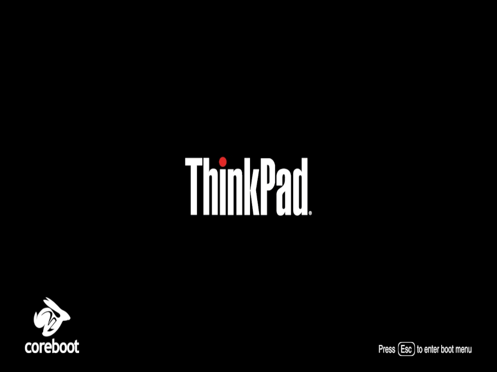
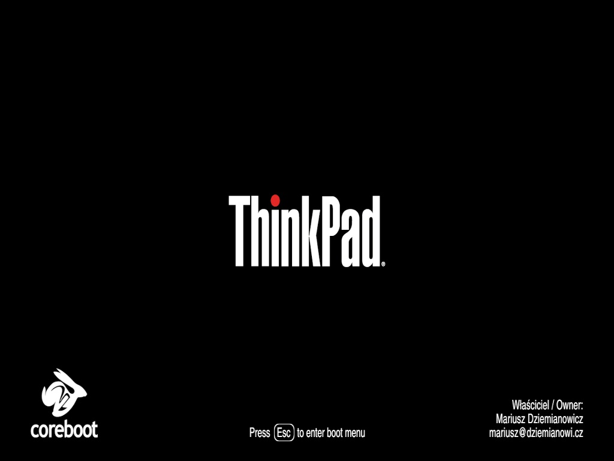

# bootsplashes

Custom coreboot splash graphics made for my Thinkpad X230.

GIMP (xcf) source files included in _assets directory.

JPEG save procedure for X230 bootsplash:

* Dimensions: 1024x768
* Progressive: off
* Subsampling: 4:2:0 (chroma quartered)

## basic

* 1024x768 (downscaled from 1366x768)
* Fonts: Nimbus Sans Narrow Semi-Condensed

